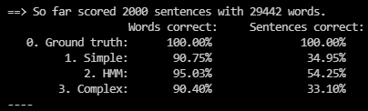
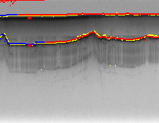
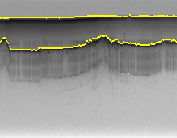
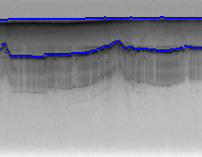
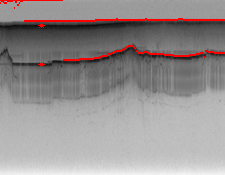

# a3

### Authors
* Harsh Srivastava <hsrivas>
* Ritwik Budhiraja <rbudhira>
* Yash Shah <yashah>

## Part 1: Part-of-speech tagging

Here is a quick snapshot for the final output at the end of the execution for `Part 1`.\
\
_Above: Performance final output._

### Section 1: Simple

(_**Posterior Calculation**_)

1. For the simplified model, the probability factorization is pretty simple and straightforward. Here for each word we have a simple emission probabliity that factors as- \
    <code>&nbsp;&nbsp;&nbsp;&nbsp;P(Si | Wi) = P(Si) * P(Wi | Si)</code>\
    <code>P(Wi | Si)</code> means we need a table from S to W mapping

(_**Code**_)

2. For this section, we have built the emission table (`tw_emission`) which is a list of dictionaries, mapping the index of training letter to the words found in the dataset.

3. The probability of a word to be a particular tag is calculated by counting the frequency of words occuring as a particular tag in the `tw_emission` table.

4. While performing the predictions we simply take the `arg max` of each given word of the sentence from the `tw_emission` table. This is done by iterating and taking max probability over possible tags for a given word.

### Section 2: HMM (Viterbi)

(_**Posterior Calculation**_)

1. For the HMM model we have the following factorization of the probability-\
    <code>P(Si | Wi) = P(Wi | Si) * P(Si)</code>
    <code> &nbsp;&nbsp;&nbsp;&nbsp;&nbsp;&nbsp;&nbsp;&nbsp;&nbsp;&nbsp;
    = P(Wi | Si) * P(Si | Si-1) * P(Si-1)</code>\
    However, for the zero-th case we can simply take the P(Wi | Si) and P(Si) since there is no Si-1 for i = 0

2. Followed by this we iterate over the length of the sentence starting from `1` and get the emission and transition probabilties and multiply them together along with the P(Si-1) to get the posteriors.

(_**Code**_)

3. The HMM prediction method uses the transition table calculated in the `train` method in the `tt_transition` matrix.

4. Our code is based on the code provided during the in-class activity and we have used it for reference.

### Section 3: Complex

(_**Posterior Calculation**_)

1. For the Complex model we have the following factorization of the probability-\
    <code>P(Si | Wi) = P(Wi | Si-1, Si) * P(Si)</code>
    <code> &nbsp;&nbsp;&nbsp;&nbsp;&nbsp;&nbsp;&nbsp;&nbsp;&nbsp;&nbsp;
    ∝ P(Wi | Si-1, Si) * P(Si | Si-2, Si-1)</code>\
    - However, for the zero-th case we can simply take the P(Wi | Si) and P(Si) since there is no Si-1 for i = 0.
    - And for the 1-st case we can simply take the transition probabiltiy P(Si | Si-2, Si-1) and P(Wi | Si-1, Si) since there is no Si-1 for i = 0.
    - After this we simply iterate through the remainder length of the sentence and calculate the probability with-\
        <code>P(Wi | Si) = P(Wi | Si-1, Si) * P(Si | Si-2, Si-1) * P(Si) 
        &nbsp;&nbsp;&nbsp;&nbsp;&nbsp;&nbsp;&nbsp;&nbsp;&nbsp;&nbsp;
        = P(Wi | Si-1, Si) * P(Si | Si-1) * P(Si | Si-2, Si-1) * P(Si-1 | Si-2) * P(Si)</code>

(_**Code**_)

2. We have used random sampling which is dependent on the input dataset. To do this there are two methods namely `sample_tag` and `sample_word` which randomly select a tag and then the word based on the values stored in the `tag_pair_to_tag_table` and `word_tag_pair_table` populated while reading the training dataset.

3. The `sample_word` takes the current word followed by previous two tags (which initially are both set to `None`).
    - Followed by this we call the `sample_tag` method to get a random choice for the current tag given previous two tags (`tag_current_minus_2`, `tag_current_minus_1`).
    - This gives us a random option for the tag, which when combined with the probability of the tag pair (`tag_current_minus_1`, `tag`) is used to get the probability of such an event happening.

4. The sampling is done at the word level, multiple times indicated by the `sampling_count` (currently set to `1000` at the point of submission).

5. The random sample for each word is added to the the `predicted_tag_infos` list. We use this list to further take an `arg max` of all such possible tags and their probabilities.

6. After this process, the final prediction is taken by measuring the highest frequency tag for the given word.

## Part 2: Ice tracking

For ice tracking here is the combined image (`ice_rock_output.png`) which combines the results for each type of model for both air-ice and ice-rock boundaries.

\
_Above: Combined Output for all models_

<pre>Please find the individual outputs for each type of model in the respective sections below.</pre>

### Section 1: Simple Bayes

For simple Bayes' method, the most basic way to find the line is using the edge matrix where we make the following assumption-
`If a pixel is high, it is much more likely to be on an edge boundary.`

_<b>Note:</b> For a better result, we first smoothen out the edge strength matrix itself, so we can have a better prediction. Here, the averaging mask actually makes the edge strength slightly worse to the human eye, however, with our logic it works better since we are also thresholding the matrix at a later point, but on a normalized matrix._

1. First, we simply go column-by-column and take the max of the globally normalized values in the column.

2. Now we threshold the column values and only keep the indices (row, value) pairs which are above 0.5

3. We sort this result and take the first row index from the (row, value) pair.

4. A neat trick that we used to find the second line is by introducing a `limiting_line` concept into the main HMM algorithm. This helped us to simply ignore the previously skipped pixels from the top and directly jump (r + 10) pixels below the last predicted line. (_Simply changing the baseline from 0 to last predicted._)

5. To find the next line, therefore, we only need to pass the predicted output of airice values.

(_In case the threshold yields no results, we do a local normalization and the repeat the above proces, one more time)._

Simple result for `09.png`\

### Section 2: HMM (Viterbi)

1. For the Viterbi HMM section, we calcualte the initial probability of the first column by simply normalizing the values with the max value in the column.

2. We use the same Viterbi code as used in the previous part, however in this case our lookup and v_table update line now contains a call to the `find_max_successor` function.

3. This function calculates the next posterior for the v_table by only considering the next column's pixels directly 10 rows above and 10 rows below the current pixel. _(10 pixels since the min gap between air-ice and ice-rock is 10 pixels high.)_ 

4. We follow the same logic for finding both lines as last section.

HMM result for `09.png`\

### Section 1: HMM (Viterbi + Feedback)

We tried using the input points to update the probabilities of the image and the v_table to 1.0.
However, we didn't reach a precise output.

The output for individual feedback line is attached below.

HMM result for `09.png`\

## Part 3: Reading text

### Section 1: Simple Bayes

1. We first read the input dataset, assuming that the input is given with pos tagging details. We split each line and take every second token from the first one to build a new line, which we use to build the transition table.

2. For the simple Bayes section-
    - We calculate the emission probabilty as a match table with n x m size, for each test letter against each training letter. (This table stores the probability of each test letter matching the training letter).
    - Next take the arg max of the emission probs for each column of the image and emit the resulting letter

We notice that the result is nearly perfect for non-noisy images, however it fails for images with high noise.

### Section 1: HMM

1. Calculate the match table with a slightly tweaked method where the match, missing pixels from the source image and missing pixels from the target image. We plan to use these metrics for the emission probs.

2. The Viterbi code remains the same, however we were not able to perfectly balance the v_table calculations, due to which the output is repetitive and gibberish.